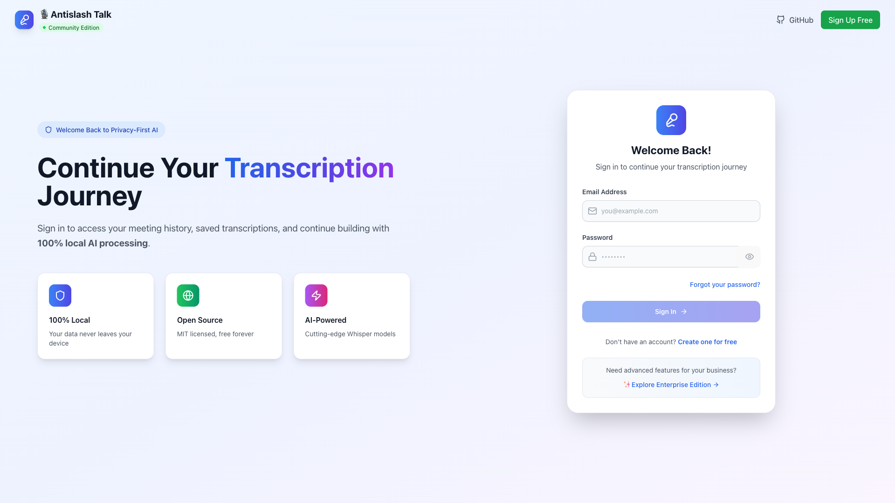

# 🎙️ Antislash Talk

**AI-Powered Meeting Transcription & Analysis Platform**

Transform your voice recordings into intelligent insights with advanced AI transcription, semantic understanding, and automated analysis.

  

## 🌟 Features

### 🎯 **Multiple Transcription Providers**
- **🔒 Local Processing** - 100% private with Whisper, Moonshine models
- **🎯 Mistral Voxtral** - Revolutionary multimodal AI with semantic understanding
- **🤖 OpenAI Whisper** - Industry-standard cloud transcription
- **🧠 Google Gemini** - Advanced multimodal capabilities

### 🚀 **Advanced Capabilities**
- **🎙️ Superior Transcription** - Voxtral outperforms Whisper on all benchmarks
- **🧠 Semantic Understanding** - Built-in Q&A and content analysis
- **🌍 Multilingual Support** - Auto-detection of 99+ languages
- **🔧 Function Calling** - Voice commands directly from audio
- **📝 Smart Enhancement** - Automated titles, summaries, and insights
- **🎯 Device Optimization** - Automatic model recommendations

### 🛡️ **Privacy & Security**
- **Local-first architecture** - Process sensitive data entirely offline
- **Encrypted API storage** - Secure cloud options when needed
- **No vendor lock-in** - Open-source with flexible deployment

## 📸 Screenshots

### 🏠 **Main Interface**

<div align="center">

| Page d'inscription "Coming Soon" | Page de connexion |
|:---:|:---:|
|  |  |
| *Nouveau design d'attente élégant* | *Interface de connexion sécurisée* |

</div>

### 🎙️ **Core Features**

<div align="center">

| Page d'enregistrement | Détail d'une réunion |
|:---:|:---:|
|  |  |
| *Contrôles d'enregistrement + paramètres IA* | *Transcript avec speakers + export multi-format* |

</div>

### ⚙️ **Advanced Features**

<div align="center">

| Paramètres et API Keys | Export multi-format |
|:---:|:---:|
|  |  |
| *Configuration des modèles IA* | *PDF, JSON, CSV, TXT avec design* |

</div>

### 📱 **Mobile Experience**

<div align="center">

| Mobile Recording | Mobile Meeting Detail |
|:---:|:---:|
|  |  |
| *Interface mobile optimisée* | *Transcript responsive* |

</div>

> 💡 **Note**: Captures d'écran de la version déployée sur [talk.antislash.studio](https://talk.antislash.studio)

## 🚀 Quick Start

### 🎯 Deploy Everything in One Command (VPS/Server)

The fastest way to deploy the complete stack with Supabase + AI:

```bash
curl -sSL https://raw.githubusercontent.com/Lamouller/Antislash-Talk/main/deploy-vps-final.sh | bash
```

**This installs everything:** Database, Auth, Storage, API, Admin UI, AI transcription, Ollama with LLM models, and more!  
**Requirements:** Ubuntu/Debian server with 8GB+ RAM, 4+ CPU cores, 50GB+ storage

---

### 💻 Local Development

#### Prerequisites

- **Node.js** 18+ and npm/yarn
- **Supabase** account (free tier available) OR use Docker Compose for local Supabase
- **Modern browser** with WebGPU support (Chrome recommended)

### 1. Clone & Install

```bash
git clone https://github.com/Lamouller/Antislash-Talk.git
cd Antislash-Talk
npm install
```

### 2. Environment Setup

Create `.env.local`:

```env
# Supabase Configuration (Required)
VITE_SUPABASE_URL=your_supabase_project_url
VITE_SUPABASE_ANON_KEY=your_supabase_anon_key

# Optional: Pre-configure API Keys
VITE_MISTRAL_API_KEY=your_mistral_api_key
VITE_OPENAI_API_KEY=your_openai_api_key
VITE_GOOGLE_API_KEY=your_google_api_key
VITE_ANTHROPIC_API_KEY=your_anthropic_api_key
```

### 3. Supabase Setup

```bash
# Install Supabase CLI
npm install -g supabase

# Login and link project
supabase login
supabase link --project-ref your-project-ref

# Run migrations
supabase db push
```

### 4. Start Development

```bash
npm run dev
```

Visit `http://localhost:5173` and start transcribing! 🎉

## 🏗️ Production Deployment

### 🚀 Quick Deploy on VPS/Server (One Command)

Deploy the complete stack (Supabase + App + PyTorch) in one command:

```bash
# On your VPS/server, run:
curl -sSL https://raw.githubusercontent.com/Lamouller/Antislash-Talk/main/deploy-vps-final.sh | bash
```

**What this deploys:**
- ✅ Complete self-hosted Supabase stack (14 services)
- ✅ PostgreSQL database with automatic setup
- ✅ Authentication (GoTrue) with admin user
- ✅ Storage API with buckets configured
- ✅ Realtime subscriptions
- ✅ Supabase Studio (admin interface) with HTTPS
- ✅ React application (frontend) with HTTPS
- ✅ PyTorch transcription service (AI - optional)
- ✅ Ollama with LLM model for titles/summaries
- ✅ Nginx with SSL certificates (HTTPS)
- ✅ CORS configured for all services

**Requirements:**
- Ubuntu 20.04+ or Debian 11+
- 8GB RAM minimum (16GB recommended with PyTorch)
- 4 vCPU minimum
- 100GB SSD storage
- Docker & Docker Compose (auto-installed by script)

**What the script does:**
1. Installs Docker and dependencies
2. Clones the repository
3. Generates secure secrets (JWT, passwords)
4. Configures environment variables
5. Builds and starts all services
6. Sets up HTTPS with self-signed certificates
7. Configures authentication for Studio
8. Installs Ollama with llama3.2:3b model
9. Configures CORS for frontend access
10. Creates admin user and storage buckets
11. Saves all credentials to `deployment-info.txt`

**After deployment, access:**
- 🌐 **Application**: `https://YOUR_IP` (HTTPS)
- 📡 **API**: `https://YOUR_IP:8443` (HTTPS)
- 🎨 **Studio Admin**: `https://YOUR_IP:8444` (HTTPS with auth)
- 🤖 **Ollama API**: `https://YOUR_IP:8445` (HTTPS with CORS)
- 🧠 **PyTorch API**: `http://YOUR_IP:8000` (if enabled)

---

### 🐳 Docker Compose - Local Development

Deploy locally with all services:

```bash
# Clone the repository
git clone https://github.com/Lamouller/Antislash-Talk.git
cd Antislash-Talk

# Copy environment example
cp env.monorepo.example .env.monorepo

# Edit with your values (or use defaults for local dev)
nano .env.monorepo

# Start all services (lightweight - no PyTorch)
docker compose -f docker-compose.monorepo.yml up -d

# OR with PyTorch for AI transcription
docker compose -f docker-compose.monorepo.yml --profile pytorch up -d
```

**Access locally:**
- Application: http://localhost:3000
- Supabase Studio: http://localhost:54323
- API: http://localhost:54321

---

### ☁️ Cloud Platforms (Frontend Only)

#### Vercel

```bash
vercel --prod
```

**Note:** Cloud deployments require a separate Supabase project (cloud or self-hosted).

---

### 🛠️ Manual Self-Hosted Setup

#### Step 1: Clone and Setup

```bash
git clone https://github.com/Lamouller/Antislash-Talk.git
cd Antislash-Talk
cp env.monorepo.example .env.monorepo
```

#### Step 2: Generate Secrets

```bash
# Generate JWT secret
JWT_SECRET=$(openssl rand -base64 45 | tr -d "=+/" | cut -c1-45)

# Generate PostgreSQL password
POSTGRES_PASSWORD=$(openssl rand -base64 32 | tr -d "=+/" | cut -c1-32)

# Generate Supabase keys
node generate-supabase-keys.js "$JWT_SECRET"
```

#### Step 3: Configure Environment

Edit `.env.monorepo` with your values:
```env
JWT_SECRET=<your-generated-secret>
POSTGRES_PASSWORD=<your-generated-password>
ANON_KEY=<generated-anon-key>
SERVICE_ROLE_KEY=<generated-service-role-key>
SITE_URL=http://YOUR_IP:3000
API_EXTERNAL_URL=http://YOUR_IP:54321
```

#### Step 4: Deploy

```bash
# Start all services
docker compose -f docker-compose.monorepo.yml --env-file .env.monorepo up -d

# Check status
docker compose -f docker-compose.monorepo.yml ps

# View logs
docker compose -f docker-compose.monorepo.yml logs -f
```

---

### 🔒 Production Security Checklist

Before going to production:

- [ ] Change all default passwords
- [ ] Configure a domain name
- [ ] Enable HTTPS/SSL (Let's Encrypt)
- [ ] Set up reverse proxy (Nginx)
- [ ] Configure automated backups
- [ ] Set up monitoring and logging
- [ ] Restrict database access
- [ ] Configure real SMTP server
- [ ] Review and set proper CORS policies
- [ ] Enable firewall rules

**Nginx reverse proxy example:**
```nginx
server {
    listen 80;
    server_name your-domain.com;
    
    location / {
        proxy_pass http://localhost:3000;
        proxy_set_header Host $host;
        proxy_set_header X-Real-IP $remote_addr;
    }
    
    location /api/ {
        proxy_pass http://localhost:54321/;
        proxy_http_version 1.1;
        proxy_set_header Upgrade $http_upgrade;
        proxy_set_header Connection 'upgrade';
    }
}
```

**SSL with Certbot:**
```bash
sudo certbot --nginx -d your-domain.com
```

### 🎯 Client Deployments

For client-specific deployments, you can hide marketing pages and enable direct login access:

```bash
# In your .env or .env.local
VITE_HIDE_MARKETING_PAGES=true
```

This configuration:
- ✅ Removes promotional content (home page, auth index)
- ✅ Redirects directly to login page
- ✅ Creates a more focused, enterprise-like experience

**📖 Full Guide:** See [Client Deployment Guide](docs/CLIENT_DEPLOYMENT.md) for complete configuration options and best practices.

## ⚙️ Configuration

### Transcription Providers

| Provider | Models Available | Use Case | Setup Required |
|----------|------------------|----------|----------------|
| **Local** | Whisper, Moonshine, Distil-Whisper | 100% Privacy | None (runs in browser) |
| **Mistral** | Voxtral Small/Mini | Advanced AI features | Mistral API key |
| **OpenAI** | Whisper-1 | Reliable cloud option | OpenAI API key |
| **Google** | Gemini 1.5 Pro/Flash | Multimodal capabilities | Google AI API key |

### Device Recommendations

The app automatically detects your device capabilities and recommends the best local models:

- **🚀 High-end (16GB+ RAM, 8+ cores)**: Distil-Whisper Large
- **⚡ Mid-range (8GB+ RAM, 4+ cores)**: Whisper Base  
- **💻 Low-end devices**: Moonshine Tiny

### API Keys Configuration

Add your API keys in **Settings → API Keys** or via environment variables:

1. **Mistral API** (for Voxtral): [console.mistral.ai](https://console.mistral.ai)
2. **OpenAI API**: [platform.openai.com](https://platform.openai.com)
3. **Google AI**: [aistudio.google.com](https://aistudio.google.com/app/apikey)
4. **Anthropic API**: [console.anthropic.com](https://console.anthropic.com)

## 🛠️ Development

### 📜 Scripts Documentation

For a complete list of available scripts and their usage, see [SCRIPTS.md](SCRIPTS.md).

### Project Structure

```
Antislash-Talk/
├── src/
│   ├── components/       # Reusable UI components
│   ├── hooks/           # Custom React hooks
│   │   ├── useLocalTranscription.ts  # Local AI processing
│   │   ├── useWebAudioRecorder.ts   # Audio recording
│   │   └── useWebAudioPlayer.ts     # Audio playback
│   ├── lib/             # Core utilities
│   │   ├── supabase.ts  # Database client
│   │   └── schemas.ts   # Type definitions
│   ├── pages/           # App pages/routes
│   └── main.tsx         # App entry point
├── supabase/            # Database schema & functions
├── packages/            # Monorepo packages
└── public/              # Static assets
```

### Key Technologies

- **Frontend**: React 18 + TypeScript + Vite
- **UI**: Tailwind CSS + Custom components
- **State**: React hooks + local storage
- **Database**: Supabase (PostgreSQL)
- **AI/ML**: Transformers.js + WebGPU
- **Audio**: Web Audio API + MediaRecorder
- **Routing**: React Router v6

### Local Development Commands

```bash
# Development
npm run dev              # Start dev server
npm run build           # Build for production
npm run preview         # Preview production build
npm run lint            # Run ESLint

# Supabase
supabase start          # Start local Supabase
supabase db push        # Apply migrations
supabase gen types      # Generate TypeScript types

# Testing
npm run test            # Run tests
npm run test:e2e        # End-to-end tests
```

## 📊 Performance Optimization

### WebGPU Acceleration

For optimal performance on supported devices:

1. **Enable WebGPU** in Chrome: `chrome://flags/#enable-webgpu`
2. **Apple Silicon Macs**: Native WebGPU support
3. **Windows/Linux**: Requires compatible GPU drivers

### Model Selection Guide

| Model | Size | Speed | Quality | Use Case |
|-------|------|-------|---------|----------|
| Moonshine Tiny | 50MB | ⚡⚡⚡ | ⭐⭐ | Mobile, quick tests |
| Whisper Tiny | 39MB | ⚡⚡ | ⭐⭐⭐ | Balanced local option |
| Whisper Base | 74MB | ⚡ | ⭐⭐⭐⭐ | Recommended local |
| Distil-Whisper Large | 756MB | ⚡ | ⭐⭐⭐⭐⭐ | High-end local |
| Voxtral Mini | API | ⚡⚡ | ⭐⭐⭐⭐⭐ | Cloud + AI features |

## 🔧 Troubleshooting

### Common Issues

**Model Loading Fails:**
```bash
# Clear browser cache and storage
# Try smaller model (Whisper Tiny)
# Check WebGPU support in chrome://gpu
```

**WebGPU Not Working:**
```bash
# Enable in chrome://flags/#enable-webgpu
# Update GPU drivers
# Try WASM fallback mode
```

**API Key Errors:**
```bash
# Verify key in Settings → API Keys
# Check API quotas and billing
# Test with different model
```

**Build Issues:**
```bash
npm run clean           # Clear node_modules
npm install             # Reinstall dependencies
npm run build           # Rebuild
```

## 🤝 Contributing

We welcome contributions! See [CONTRIBUTING.md](CONTRIBUTING.md) for guidelines.

### Development Workflow

1. Fork the repository
2. Create feature branch: `git checkout -b feature/amazing-feature`
3. Make changes and test locally
4. Commit with conventional commits: `git commit -m "feat: add amazing feature"`
5. Push and create Pull Request

### Code Standards

- **TypeScript** strict mode
- **ESLint** + Prettier formatting
- **Component-first** architecture
- **Accessibility** (WCAG 2.1)
- **Performance** optimizations

## 📄 License

This project is licensed under the MIT License - see the [LICENSE](LICENSE) file for details.

## 🙏 Acknowledgments

- **Mistral AI** for revolutionary Voxtral models
- **OpenAI** for Whisper speech recognition
- **Hugging Face** for Transformers.js
- **Supabase** for backend infrastructure
- **Useful Sensors** for Moonshine models

## 🆘 Support

- **📚 Documentation**: [Wiki](https://github.com/Lamouller/Antislash-Talk/wiki)
- **🐛 Bug Reports**: [Issues](https://github.com/Lamouller/Antislash-Talk/issues)
- **💬 Discussions**: [GitHub Discussions](https://github.com/Lamouller/Antislash-Talk/discussions)
- **📧 Email**: support@talk2web.com

---

**Built with ❤️ by Antislash Studio**

*Transform conversations into insights with the power of AI*
